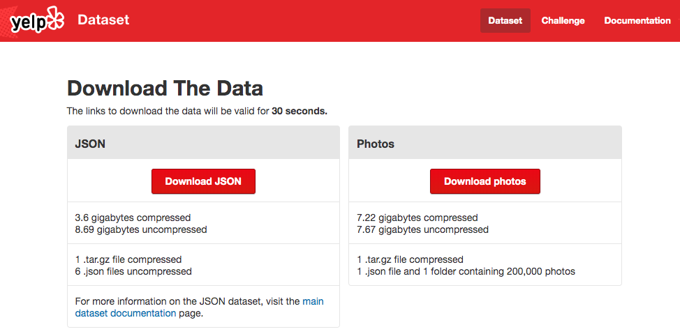
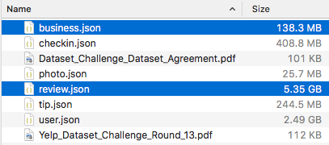

     

<h1>
A Simple Text Search Engine
</h1>
<!-- TOC -->

- [1. Coming Enhancement](#1-coming-enhancement)
- [2. Background of Assignment](#2-background-of-assignment)
- [3. Application Version](#3-application-version)
- [4. System Requirements](#4-system-requirements)
- [5. How to Install and Start Up the Search Engine](#5-how-to-install-and-start-up-the-search-engine)
  - [5.1. Step 1: Open Windows Command Prompt](#51-step-1-open-windows-command-prompt)
  - [5.2. Step 2: Run application](#52-step-2-run-application)
    - [5.2.1. Optional JDK Parameters](#521-optional-jdk-parameters)
    - [5.2.2. Mandatory Parameters](#522-mandatory-parameters)
    - [5.2.3. Another Optional Parameters](#523-another-optional-parameters)
- [6. An Example Log](#6-an-example-log)
- [7. Access the Web User Interface](#7-access-the-web-user-interface)
  - [7.1. search input page](#71-search-input-page)
  - [7.2. some testing data](#72-some-testing-data)
- [8. Logging](#8-logging)
- [9. Compile and Re-Package the Application (Optional)](#9-compile-and-re-package-the-application-optional)
  - [9.1. Step 1: Install Maven into your computer](#91-step-1-install-maven-into-your-computer)
  - [9.2. Step 2: Execute Maven command](#92-step-2-execute-maven-command)
  - [9.3. Step 3: Get the .jar](#93-step-3-get-the-jar)
- [10. Appendix - List of Open Source Libraries](#10-appendix---list-of-open-source-libraries)
- [11. How to Start Application at Eclipse](#11-how-to-start-application-at-eclipse)

<!-- /TOC -->

# 1. Coming Enhancement

-   Planning at **15 Feb 2020**
    -   Re-structure the project
    -   Include shell commands example for the execution
    -   Update README.md to date
    -   Provide more details in the project in README.md
    -   More unit test
    -   Upgrade Java version to Java 13
    -   Upgrade dependencies to fix security alarm
    -   Docker image for full independent environment

# 2. Background of Assignment

It is an assignment to use Apache Lucene to build a simple text search engine for **Information Retrieval** course.


The dataset is from [Yelp Dataset Challenge](http://www.yelp.com/dataset_challenge)

The full compressed dataset size is 3.6GB.



`business.json` and `review.json` will be used



# 3. Application Version

-   **Version**: 1.0.0
-   **Development time**: 2015

# 4. System Requirements

1.  Windows 7 or above;
2.  JDK 1.7.0.10 installed or above; please use 64bit JDK. 32bit JDK will fail.
    -   You can use the following command to check the JDK version: `java -version`
3.  If you run the full dataset for this assignment, it is required to allocate around 9 GB of your hard disk space.

# 5. How to Install and Start Up the Search Engine

The executable application is: `ntu-text-search-engine.jar`. The .jar file you can find it under `SourceCode` folder (as required by the assignment).

There is no need to compile or re-package the `.jar` from the source code.

To start the search engine, you need to use command `java -jar`.

Here is a step by step example of starting the search engine:

## 5.1. Step 1: Open Windows Command Prompt

-   Approach One: You may use Win Flag + r, then key in "cmd" (without the double quotes), then click OK to open Command Prompt.
-   Approach Two: You may use Win Start icon, then click "All Programs", then click "Accessories", then click "Command Prompt".

## 5.2. Step 2: Run application

Assume the folder with search engine and dataset as below:

``` {.cmd}
D:\ir
|-ntu-text-search-engine.jar
|-dataset
    |-yelp_academic_dataset_business.json
    |-yelp_academic_dataset_review.json
```

> PS: It strongly recommend you to put the search engine jar, dataset, and index folders under the D: drive (not C: drive) to avoid unnecessary permission issues from the Windows OS.

A example of the command as following:

``` {.cmd}
java -Xms1024m -Xmx1024m -jar D:\ir\ntu-text-search-engine.jar \
    sourcereview="D:\ir\dataset\yelp_academic_dataset_review.json" \
    sourcebusiness="D:\ir\dataset\yelp_academic_dataset_business.json" \
    folderindex="D:\ir\index"
```

The syntax of the command and the command parameters are as follows:

### 5.2.1. Optional JDK Parameters

-   **-Xms**: Minimum JDK memory located in this search engine during the run time. In this example, the value is 1024m.
-   **-Xmx**: Maximum JDK memory located in this search engine during the run time. In this example, the value is 1024m.

> PS: If you face issue \"Error: Could not create the Java Virtual Machine. Error: A fatal exception has occurred. Program will exit.\", that means you do not have enough memory in your PC. So you can set a smaller values to these parameters, such as "-Xms512m -Xmx512m", or even "-Xms256m -Xmx256m". However it will slow down the process to start up the search engine.

### 5.2.2. Mandatory Parameters

-   **sourcereview**: location of view dataset. In this example, the value is `D:\ir\dataset\yelp_academic_dataset_review.json`
-   **sourcerebusiness**: location of business dataset. In this example, the value is `D:\ir\dataset\yelp_academic_dataset_business.json`
-   **folderindex**: location of folder to keep the generated indexing files. In this example, the value is `D:\ir\index`.

### 5.2.3. Another Optional Parameters

-   **iscreateindex**: whether to clean up the indexing folder and re-create the indexing files. Value is either true or false, default value is true.
-   **serverport**: web server port value. Value is Integer data type, default is `8585`. If the console shows `java.net.BindException: Address already in use: bind` then you need to provide other value for the web server port.

# 6. An Example Log

An example about the command and the startup logging:

``` {.cmd}
C:\Users\administrator>java -Xms1024m -Xmx1024m -jar d:\ir\ntu-text-search-engine.jar sourcereview="D:\ir\dataset\yelp_academic_dataset_review.json" sourcebusiness=
D:\ir\dataset\yelp_academic_dataset_business.json" folderindex="D:\ir\index"
2015-04-06 19:05:46,459 INFO Log4j appears to be running in a Servlet environment, but there's no log4j-web module available. If you want better web
ontainer support, please add the log4j-web JAR to your web archive or server lib directory.

2015-04-06 19:05:46:551 [INFO] - fixJettyJdkIssue...
2015-04-06 19:05:46:552 [INFO] - analyzeCommand...
2015-04-06 19:05:46:553 [INFO] - command parameter: sourcereview=D:\ir\dataset\yelp_academic_dataset_review.json
2015-04-06 19:05:46:555 [INFO] - command parameter: sourcebusiness=D:\ir\dataset\yelp_academic_dataset_business.json
2015-04-06 19:05:46:555 [INFO] - command parameter: folderindex=D:\ir\index
2015-04-06 19:05:46:556 [INFO] - validateSourceFiles...
2015-04-06 19:05:46:558 [INFO] - startupWebServer...
2015-04-06 19:05:46:598 [INFO] - WebServlet() instancing...
2015-04-06 19:05:46.617:INFO:oejs.Server:jetty-8.y.z-SNAPSHOT
2015-04-06 19:05:46.874:INFO:oejs.AbstractConnector:Started SelectChannelConnector@0.0.0.0:8585
2015-04-06 19:05:46:875 [INFO] - clearIndexFolder...
2015-04-06 19:05:46:877 [INFO] - buildBusinessIndex...
2015-04-06 19:05:46:882 [INFO] - case=true, stop=true, stem=true
2015-04-06 19:05:46:997 [INFO] - index for: D:\ir\dataset\yelp_academic_dataset_business.json
2015-04-06 19:05:51:555 [INFO] - time cost indexing (ms): 4558
skipped the log for creating other index files
2015-04-06 19:32:30:385 [INFO] - ***********************************************************
2015-04-06 19:32:30:386 [INFO] - *              <<APPLICATION STARTED>>                 *
2015-04-06 19:32:30:386 [INFO] - * ECLIPSE_RUNNING_MODE=false
2015-04-06 19:32:30:387 [INFO] - * TEST_MODE=false
2015-04-06 19:32:30:389 [INFO] - * PATH_SOURCE_REVIEW=D:\ir\dataset\yelp_academic_dataset_review.json
2015-04-06 19:32:30:390 [INFO] - * PATH_SOURCE_BUSINESS=D:\ir\dataset\yelp_academic_dataset_business.json
2015-04-06 19:32:30:391 [INFO] - * PATH_INDEX_ROOT=D:\ir\index
2015-04-06 19:32:30:392 [INFO] - * IS_CREATE_INDEX=true
2015-04-06 19:32:30:393 [INFO] - * JETTY_PORT=8585
2015-04-06 19:32:30:394 [INFO] - ***********************************************************
```

The startup of the search engine takes around 27 minutes in the following experimental environment:

``` {.cmd}
Windows edition: Windows 7 Professional Service Pack 1
System Processor: Intel(R) Core(TM) i7-3520M CPU @ 2.90GHz
System Installed memory (RAM): 8.00 GB
System type: 64-bit Operating System
JDK:
java version "1.7.0_71"
Java(TM) SE Runtime Environment (build 1.7.0_71-b14)
Java HotSpot(TM) 64-Bit Server VM (build 24.71-b01, mixed mode)
```

Below lines are the indicator to show that the search engine is started successfully:

``` {.cmd}
***********************************************************
*               <<APPLICATION STARTED>>                 *
... ...
***********************************************************
```

After the search engine starts, the folder structure of the search engine, dataset and indexing files will be as below:

``` {.cmd}
D:\ir
|-ntu-text-search-engine.jar
|-dataset
    |-yelp_academic_dataset_business.json
    |-yelp_academic_dataset_review.json
|-index
# indexing file for yelp_academic_dataset_business.json, indexing files are inside the folder.
    |-index_business_caseN_stopN_stemN
    |-index_business_caseN_stopN_stemY
    |-index_business_caseN_stopY_stemN
    |-index_business_caseN_stopY_stemY
    |-index_business_caseY_stopN_stemN
    |-index_business_caseY_stopN_stemY
    |-index_business_caseY_stopY_stemN
    |-index_business_caseY_stopY_stemY
# indexing file for yelp_academic_dataset_review.json, indexing files are inside the folder.
    |-index_review_caseN_stopN_stemN
    |-index_review_caseN_stopN_stemY
    |-index_review_caseN_stopY_stemN
    |-index_review_caseN_stopY_stemY
    |-index_review_caseY_stopN_stemN
    |-index_review_caseY_stopN_stemY
    |-index_review_caseY_stopY_stemN
    |-index_review_caseY_stopY_stemY
```

# 7. Access the Web User Interface

By default, here are the URL you can use:

## 7.1. search input page

in this page you can perform the search by clicking "Search" button, or you can click "Reset" link to clean the search result.

-   `http://localhost:8585/ntu-text-search-engine`, or
-   `http://localhost:8585/ntu-text-search-engine/index.jsp`

## 7.2. some testing data

`http://localhost:8585/ntu-text-search-engine/index_test.jsp`

# 8. Logging

Log file is at `%user_home%/ntu-text-search-engine/info.log`

# 9. Compile and Re-Package the Application (Optional)

Java is a cross operation system language, so you can use ntu-text-search-engine.jar at Windows platform or Linux platform if you installed the JDK.

However, if you want to compile and re-package the application form the source code, you need to follow the below steps.

## 9.1. Step 1: Install Maven into your computer

URL for download and installation instructions: `https://maven.apache.org/download.cgi`

## 9.2. Step 2: Execute Maven command

Use command to the source code folder and execute Maven command. Here is a example:

``` {.cmd}
D:\ir>cd D:\ir\source\ntu-text-search-engine
D:\ir\source\ntu-text-search-engine>mvn clean package
... ... # downloading the dependency jar from Internet
[INFO] ------------------------------------------------------------------------
[INFO] BUILD SUCCESS
[INFO] ------------------------------------------------------------------------
[INFO] Total time: 01:13 min
[INFO] Finished at: 2015-04-08T11:50:11+08:00
[INFO] Final Memory: 33M/1235M
[INFO] ------------------------------------------------------------------------
```

## 9.3. Step 3: Get the .jar

Find your package Java jar, it is under the target folder of the source code location.

Assume the source code location is: `D:\ir>cd D:\ir\source\ntu-text-search-engine`

So the location of the jar is: `F:\ir\source\ntu-text-search-engine\target\ntu-text-search-engine.jar`

# 10. Appendix - List of Open Source Libraries

By right all the dependency libraries are downloaded by Maven automatically.

It is no need to download the dependency libraries by URL one by one.

Here is a list for reference.

| Libraries       | Description                                                                                   | Jars                                                                                                                |
|-----------------|-----------------------------------------------------------------------------------------------|---------------------------------------------------------------------------------------------------------------------|
| Lucene          | To provide the main query function<br>for the most of operations of<br>the search engine.     | lucene-core-5.0.0.jar<br>lucene-queryparser-5.0.0.jar<br>lucene-analyzers-common-5.0.0.jar<br>lucene-join-5.0.0.jar |
| Java EE         | To provide web browser user<br>interface function.                                            | jstl-1.2.jar<br>jsp-api-2.2.jar<br>(only uses at compiling time)                                                    |
| Jetty Libraries | To provide embedded web server<br>which can support the<br>web browser user interface.        | jetty-server-8.1.9.v20130131.jar<br>jetty-webapp-8.1.9.v20130131.jar<br>etty-jsp-8.1.9.v20130131.jar                |
| Google          | To provide the JSON format file<br>parsing function to read the<br>JSON format dataset files. | json-simple-1.1.jar                                                                                                 |
| Utility         | To provide the utility functions for<br>the search engine such as system logging.             | commons-io-2.4.jar<br>spring-core-4.1.6.RELEASE.jar<br>log4j-api-2.2.jar<br>log4j-core-2.2.jar                      |

# 11. How to Start Application at Eclipse

Run at Eclipse on `MainTest.java`

The change on the JSP can refresh without re-boot

-   search input page, default entry, same as index.jsp: <http://localhost:8585/ntu-text-search-engine>
-   search input page: <http://localhost:8585/ntu-text-search-engine/index.jsp>
-   page with test data: <http://localhost:8585/ntu-text-search-engine/index_test.jsp>
-   search result page: <http://localhost:8585/ntu-text-search-engine/search>
